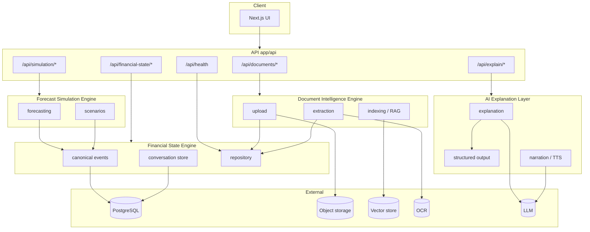

# Architecture

The system is organized around **four engines** plus a thin API boundary. **AI is confined to the AI Explanation Layer** — it does not perform financial calculations, persist canonical data, or own storage/indexing logic.

## Core engines

| Engine | Directory | Role | Must NOT |
|--------|-----------|------|----------|
| **Document Intelligence** | `services/document-intelligence/` | PDF/image intake, OCR, structuring, chunking, embeddings, RAG retrieval | Write canonical ledger; run forecasts; open-ended reasoning |
| **Financial State** | `services/financial-state/` | Canonical data model, Postgres/Prisma, conversation transcript storage | Call LLMs; compute projections |
| **Forecast Simulation** | `services/forecast-simulation/` | Deterministic cash-flow and scenario math | Call LLMs; mutate canonical state without validated ingest |
| **AI Explanation** | `services/ai-explanation/` | LLM narration and reasoning over **read-only snapshots** | Calculate balances; write DB; index vectors |

### Dependency rule (one direction)

```
Document Intelligence ──ingest (validated)──► Financial State
Financial State ──read-only snapshots──► Forecast Simulation
Financial State + Forecast Simulation + Document RAG ──snapshots──► AI Explanation
```

AI Explanation may **request** reads via Financial State and Document Intelligence services; it never bypasses them to touch Prisma or the vector store directly.

## AI boundaries

All LLM usage lives in `services/ai-explanation/` and `prompts/explanation/`.

| Rule | Detail |
|------|--------|
| Validated JSON | LLM outputs pass through `structuredOutputService` with `schemaId` + `schemaVersion` |
| No direct DB writes | Explanation layer returns text/JSON; Financial State engine applies ingest |
| No calculations | Forecasts and scenarios come only from `forecast-simulation/` |
| No storage | Embeddings, files, and transcripts are owned by Document Intelligence + Financial State |

Document Intelligence may use **constrained** structuring prompts (`prompts/document-intelligence/`) to produce JSON for human/validator review before canonical ingest — that is parsing, not household reasoning.

## High-level flow



### End-to-end pipeline (future)

1. **Upload** → Document Intelligence stores file metadata (via Financial State for DB rows).
2. **Extract** → OCR + structured payload (validated JSON).
3. **Ingest** → Financial State writes `CanonicalFinancialEvent` records.
4. **Simulate** → Forecast Simulation reads ledger snapshot; returns deterministic projections.
5. **Explain** → AI Explanation receives snapshot IDs + user question; returns narrative only.

## Repository layout

```
apps/web/
├── app/api/
│   ├── documents/           # Document Intelligence
│   ├── financial-state/     # Financial State
│   ├── simulation/          # Forecast Simulation
│   └── explain/               # AI Explanation
├── services/
│   ├── document-intelligence/
│   │   ├── upload/
│   │   ├── extraction/
│   │   └── indexing/
│   ├── financial-state/
│   ├── forecast-simulation/
│   └── ai-explanation/
├── types/
│   ├── documents.ts
│   ├── financial-state.ts     # Canonical model
│   ├── simulation.ts        # Deterministic I/O
│   └── explanation.ts       # LLM contracts
├── prompts/
│   ├── document-intelligence/
│   └── explanation/
└── features/                  # UI slices (call engines, not Prisma/LLM directly)
```

## Engine reference

### Document Intelligence Engine

| Service | File | API |
|---------|------|-----|
| Upload | `upload/document-upload.service.ts` | `POST /api/documents/upload` |
| OCR | `extraction/ocr.service.ts` | (internal) |
| Extraction | `extraction/document-extraction.service.ts` | `POST /api/documents/extraction` |
| Embeddings | `indexing/embedding.service.ts` | `POST /api/documents/embeddings` |
| RAG | `indexing/rag.service.ts` | `POST /api/documents/rag` |

### Financial State Engine

| Module | File | Role |
|--------|------|------|
| **Computation (pure)** | `engine.ts`, `normalize.ts`, `projection.ts`, `simulation.ts`, `risk.ts` | Deterministic model: events → timeline → risk (no AI, no DB) |
| Repository | `repository.service.ts` | Prisma / health (`GET /api/health`) |
| Persistence | `financial-state.persistence.ts` | `FinancialState` + `FinancialEvent` tables; computed/timeline derived at read |
| Canonical ingest | `canonical-event.service.ts` | `POST /api/financial-state/events`, `GET /api/financial-state/state` |
| Conversation store | `conversation-store.service.ts` | Transcript persistence (internal) |
| **Risk engine** | `risk.ts` | `computeRiskSignals(timeline, context?)` → `FinancialRiskReport` (deterministic, no AI) |

**Canonical data model** (`types.ts` + `normalize.ts`):

- `FinancialEvent` — strict types; `start_date` / `end_date` as `Date`; default currency `CAD`
- `RawFinancialEvent` — flexible AI/import shape (`metadata` as loose object)
- `normalizeFinancialEvents()` — pure, deterministic; drops malformed rows (no throws); no AI/DB

**`FinancialStateEngine`** exports: `normalizeFinancialEvents`, `projectMonth`, `simulateForecast`, `computeRiskSignals`, `buildSnapshot`.

| API | Purpose |
|-----|---------|
| `POST /api/financial-state/snapshot` | In-memory snapshot: state + 12-month timeline + risk |
| `GET /api/financial-state/ledger` | DB ledger (not implemented) |

Types: `services/financial-state/types.ts` (re-exported from `@/types/financial-state`).

### Forecast Simulation Engine

| Service | File | API |
|---------|------|-----|
| Forecasting | `forecasting-engine.service.ts` | `POST /api/simulation/forecast` |
| Scenarios | `scenario-simulation.service.ts` | `POST /api/simulation/scenarios`, `GET .../[id]` |

Types: `types/simulation.ts`. Outputs include `engineVersion` for auditability.

### AI Explanation Layer

| Service | File | API |
|---------|------|-----|
| Explanation | `explanation.service.ts` | `POST /api/explain` |
| **Financial Advisor** | `services/ai/advisor/` | `POST /api/explain` (via `generateFinancialAdvice`) |
| **Scenario Chat** | `services/scenario-chat/` | `POST /api/scenario-chat` — NL → engines → advisor |
| Structured output | `structured-output.service.ts` | (internal) |
| Narration | `narration.service.ts` | `POST /api/explain/narration` |

Types: `types/explanation.ts`. Prompts: `prompts/explanation/`.

## RAG specification (Document Intelligence)

| Concern | Owner | Notes |
|---------|-------|-------|
| Chunk strategy | Document Intelligence | Semantic sections per document type |
| Embedding model | Document Intelligence | Provider configured via env; not LLM explanation |
| Retrieval | `DocumentRagService` | top-k + optional rerank; household/document ownership in filters |
| Ownership | Financial State | `householdId` / `documentId` on canonical rows |

RAG results are passed to AI Explanation as **read-only excerpt snapshots**, not as writable truth.

## API conventions

- Success: `{ success: true, data: T }`
- Errors: `{ success: false, error: { code, message } }`
- Scaffold routes return **501** until implemented
- `GET /api/health` — Financial State database connectivity

## Adding a capability

1. Choose the **engine** (only one).
2. Add types under `types/<domain>.ts`.
3. Implement service under `services/<engine>/`.
4. Add prompts only if LLM is involved (`prompts/explanation/` or constrained parser in `document-intelligence/`).
5. Expose a thin route under the matching `app/api/<engine>/` prefix.
6. Add Prisma models in Financial State when persistence is required.

## Related docs

- [Setup](../README.md#setup--development)
- [Dependencies](./DEPENDENCIES.md)
- [Environment variables](../apps/web/.env.example)
